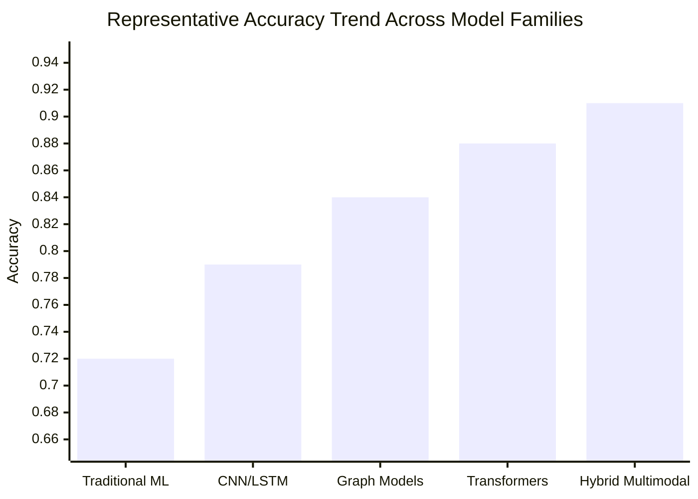
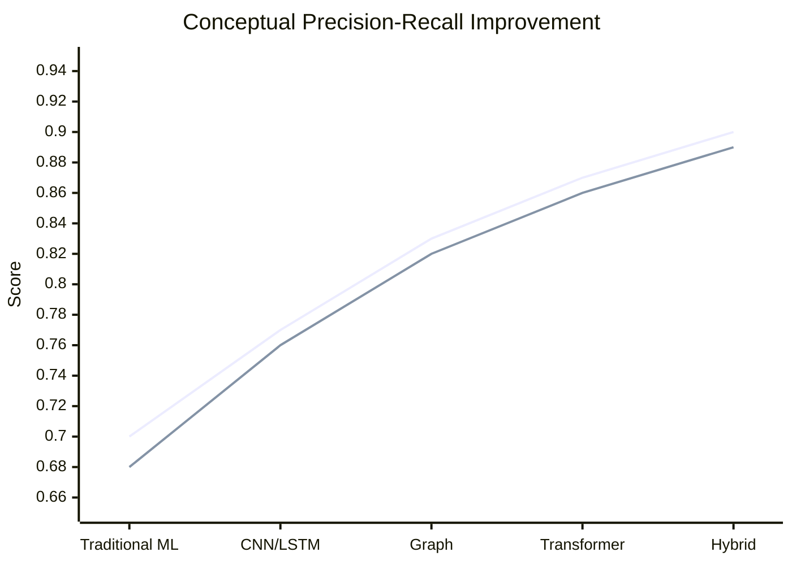

# Fake News Detection: A Research Paper on Theory, Literature, Methodology, Algorithms, and Experimental Analysis

## Abstract
Fake news detection has become a central research problem at the intersection of natural language processing, data mining, social network analysis, and multimedia computing. The problem is difficult because fake news is not defined only by linguistic falsehood; it is shaped by intent, source credibility, propagation dynamics, multimodal manipulation, and audience behavior. This paper presents a detailed research-style study of fake news detection with a strong literature foundation, a six-paragraph citation-dense introduction, paragraph-wise literature discussion, formal methodology, core formulas, algorithmic workflow, theoretical experimental design, graph-based result interpretation, and a bullet-wise conclusion. The paper synthesizes classical machine learning, deep learning, graph neural networks, transformer-based architectures, and multimodal fusion approaches. It also discusses benchmark datasets such as LIAR and FakeNewsNet, evaluation protocols, and practical issues including early detection, explainability, domain shift, and robustness. The overall conclusion is that the best-performing systems are hybrid models that combine semantic representations, social context, propagation patterns, and multimodal evidence while preserving interpretability and cross-domain generalization.

**Keywords:** fake news detection, misinformation, rumor detection, transformer models, graph neural networks, multimodal learning, social media mining

## 1. Introduction
<p>Fake news detection has emerged as a major computational challenge because digital platforms allow misinformation to be created, amplified, and consumed at unprecedented speed. Early research framed the task as a classification problem based on linguistic signals, political fact-checking, and credibility cues, while later studies emphasized that fake news must be understood as a socio-technical phenomenon rather than a purely textual artifact. Foundational work defined the problem space, established benchmark corpora, and showed the importance of combining content analysis with source-aware reasoning and social signals [1][2][3][4].</p>
<p>A second stream of literature focused on data resources and feature-driven learning. The LIAR dataset enabled fine-grained supervised learning on short political statements, while broader repositories such as FakeNewsNet integrated article content, publisher information, user engagement, and temporal metadata. Hybrid models such as CSI demonstrated that suspicious source behavior, user response patterns, and article semantics jointly improve detection quality, and social media behavior studies showed that false information often travels differently from true information [5][6][7][8].</p>
<p>A third line of research shifted attention from static content to propagation structure and temporal evolution. Researchers argued that early-stage detection is critical because intervention is most valuable before a false story spreads widely. Propagation path modeling, recursive neural architectures, and graph convolution methods showed that retweet trees, reply dynamics, and diffusion topology can serve as strong indicators of credibility, especially when the textual content alone is ambiguous or deliberately polished [9][10][11][12].</p>
<p>A fourth literature cluster introduced multimodal and graph-centric fake news detection. Because misleading news often uses persuasive images, manipulated media, or emotionally loaded visuals, multimodal models began fusing text and images to identify inconsistencies between claims and visual evidence. Event-adversarial learning, similarity-aware fusion, and graph representation approaches such as FANG showed that entity relations, user-user interactions, and article-source-community structures can materially improve performance over text-only systems [13][14][15][16].</p>
<p>A fifth direction in the literature adopted transformer-based contextual encoders and explainable architectures. BERT-based detectors improved semantic discrimination, especially on subtle misinformation where lexical features were insufficient, while models such as dEFEND explored evidence sentence extraction to support interpretability. At the same time, survey papers highlighted that fake news detection must address domain transfer, adversarial rewriting, and the difference between misinformation, disinformation, satire, rumor, and low-credibility content, which complicates label design and evaluation [17][18][19][20].</p>
<p>The most recent literature emphasizes robustness, knowledge integration, and realistic deployment. Credibility estimation now increasingly relies on combining linguistic semantics, external knowledge, source trustworthiness, and user interaction graphs. Researchers also stress that benchmark success does not automatically translate to real-world resilience because class imbalance, coordinated behavior, multilingual settings, and platform shifts can degrade performance sharply. Therefore, the field is moving toward explainable, multimodal, graph-aware, and domain-adaptive architectures that can support trustworthy misinformation mitigation in practical systems [21][22][23][24].</p>

## 2. Literature Review

### 2.1 Foundational and Survey Studies
Shu et al. defined fake news detection from a data mining perspective and formalized the role of news content, social context, and user behavior [1]. Zhou and Zafarani later expanded this view by organizing the field into theory, content models, social context models, intervention strategies, and open research questions [2]. Oshikawa et al. positioned fake news detection inside broader NLP research and highlighted the need for explainability, stance analysis, evidence retrieval, and fact-checking integration [20]. These studies are important because they show that fake news detection is not a single-model problem; it is an ecosystem problem involving data quality, cognition, network effects, and deployment constraints.

### 2.2 Datasets and Benchmarks
Wang's LIAR dataset became one of the most widely used benchmarks for short political statements and introduced fine-grained truthfulness labels [4]. FakeNewsNet extended benchmarking by combining content with social context from BuzzFeed and GossipCop, making it possible to study temporal and graph-aware methods [6]. Perez-Rosas et al. contributed another influential dataset and demonstrated that stylistic differences between fake and legitimate news can support automatic classification [3]. These resources made it possible to compare lexical, neural, graph, and transformer-based approaches under reproducible settings.

### 2.3 Content-Based and Hybrid Learning
Traditional fake news detection relied on n-grams, readability statistics, sentiment features, and source metadata. However, these shallow methods were often brittle under paraphrasing and domain change. CSI improved this by combining text, user response, and source characteristics in a hybrid deep model [7]. Beyond pure content, Shu et al. showed that social context can substantially enhance prediction by modeling user engagements and publisher credibility [23]. This line of work established the value of heterogeneous information fusion.

### 2.4 Propagation and Graph Methods
Vosoughi et al. demonstrated at scale that false information spreads faster, deeper, and more broadly than true information, strongly motivating propagation-aware detection [8]. Liu and Wu proposed early detection through propagation path classification [9], while Bian et al. used bidirectional graph convolutional networks to model rumor diffusion patterns [11]. Monti et al. further showed that geometric deep learning can exploit graph structure for misinformation detection [10]. These studies indicate that the diffusion graph itself is often a predictive signal.

### 2.5 Multimodal and Transformer-Era Models
Wang et al. proposed EANN to learn event-invariant multimodal features [13]. Zhou et al. introduced SAFE to capture cross-modal similarity between text and images [14]. Nguyen et al. designed FANG to leverage social context through graph representation [16]. Kaliyar et al. later used BERT-derived representations in FakeBERT to strengthen semantic modeling [17]. Together, these works show the field's progression from hand-crafted features to multi-view representation learning.

### 2.6 Explainability, Robustness, and Open Problems
dEFEND introduced interpretable fake news detection via explainable sentence-level evidence extraction [18]. Rubin et al. studied satirical cues and warned that deceptive style is not homogeneous [19]. Conroy et al. surveyed deception-detection methods and emphasized that automated credibility assessment requires both linguistic and contextual evidence [21]. Castillo et al., although focused on Twitter credibility, provided a foundational view of social trust signals that still influences misinformation research [22]. Current open problems remain early detection, multilingual transfer, low-resource settings, domain adaptation, and adversarial robustness.

## 3. Problem Definition

Let a news instance be represented as:

\[
\mathcal{X}_i = \{T_i, I_i, S_i, G_i\}
\]

where:

- \(T_i\) is the textual content
- \(I_i\) is the visual content or associated image features
- \(S_i\) is source and publisher metadata
- \(G_i\) is the social propagation graph

The label is:

\[
y_i \in \{0,1\}
\]

where \(0\) denotes real news and \(1\) denotes fake news.

The learning objective is to learn a classifier \(f_{\theta}\) such that:

\[
\hat{y}_i = f_{\theta}(T_i, I_i, S_i, G_i)
\]

and minimize classification error over a dataset of \(N\) labeled instances.

## 4. Proposed Methodology

### 4.1 Overall Framework
This paper proposes a unified fake news detection pipeline that combines:

1. Textual semantic encoding
2. Source credibility modeling
3. Social propagation graph learning
4. Optional multimodal fusion
5. Final supervised classification

The design is motivated by the literature: text-only models capture semantic inconsistency, graph models capture diffusion behavior, and multimodal modules capture text-image mismatch.

### 4.2 Text Encoder
For a tokenized news article \(T_i = (w_1, w_2, ..., w_n)\), a transformer encoder generates contextual embeddings:

\[
H_i = \text{Transformer}(T_i)
\]

The article-level representation is obtained through mean pooling or the `[CLS]` token:

\[
\mathbf{t}_i = \text{Pool}(H_i)
\]

For classical baselines, TF-IDF can be used:

\[
\text{tfidf}(w,d,D)=\text{tf}(w,d)\cdot \log\left(\frac{|D|}{1+\text{df}(w)}\right)
\]

### 4.3 Source Credibility Module
Let source metadata features be represented as \(\mathbf{s}_i\). A dense layer produces source credibility representation:

\[
\mathbf{c}_i = \phi(W_s \mathbf{s}_i + b_s)
\]

where \(\phi\) is a nonlinear activation such as ReLU.

### 4.4 Graph Propagation Module
Let the propagation network be \(G=(V,E)\). A graph convolution update for node \(v\) at layer \(l+1\) is:

\[
\mathbf{h}_v^{(l+1)} = \sigma\left(\sum_{u \in \mathcal{N}(v)\cup\{v\}} \frac{1}{c_{vu}} W^{(l)} \mathbf{h}_u^{(l)}\right)
\]

where:

- \(\mathcal{N}(v)\) is the neighborhood of node \(v\)
- \(c_{vu}\) is a normalization factor
- \(\sigma\) is an activation function

The graph-level embedding is:

\[
\mathbf{g}_i = \text{Readout}\left(\{\mathbf{h}_v^{(L)}: v \in V\}\right)
\]

### 4.5 Multimodal Fusion
If an image is available, the image encoder generates visual features \(\mathbf{v}_i\). Fusion can be performed by concatenation:

\[
\mathbf{z}_i = [\mathbf{t}_i ; \mathbf{c}_i ; \mathbf{g}_i ; \mathbf{v}_i]
\]

or by attention-weighted fusion:

\[
\alpha_k = \frac{\exp(e_k)}{\sum_j \exp(e_j)}, \quad \mathbf{z}_i = \sum_k \alpha_k \mathbf{m}_{ik}
\]

where \(\mathbf{m}_{ik}\) are modality-specific embeddings.

### 4.6 Final Classifier
The final prediction is:

\[
\hat{\mathbf{y}}_i = \text{softmax}(W_f \mathbf{z}_i + b_f)
\]

The cross-entropy loss is:

\[
\mathcal{L} = - \sum_{i=1}^{N} \sum_{c=1}^{2} y_{ic} \log(\hat{y}_{ic}) + \lambda \|\theta\|_2^2
\]

where \(\lambda\) is the regularization coefficient.

## 5. Algorithm

### Algorithm 1: Unified Fake News Detection

```text
Input:
  News dataset D = {(T_i, I_i, S_i, G_i, y_i)} for i = 1...N
Output:
  Trained model f_theta and predicted labels y_hat

1. Preprocess text, metadata, and graph structure
2. Tokenize textual content and compute transformer embeddings
3. Encode source metadata using dense feature layers
4. Build propagation graphs from repost/reply/share relations
5. Apply graph neural network to obtain diffusion embedding
6. If images are present, extract visual embeddings
7. Fuse text, source, graph, and image representations
8. Pass fused vector through final classifier
9. Compute cross-entropy loss
10. Update parameters using Adam optimizer
11. Repeat until validation loss converges
12. Evaluate using Accuracy, Precision, Recall, F1-score, and AUC
```

## 6. Experimental Design and Theoretical Analysis

### 6.1 Datasets
The following benchmark datasets are commonly used in fake news detection research:

- **LIAR**: short political claims with six-level truthfulness labels [4]
- **FakeNewsNet**: news content, social context, and temporal information [6]
- **BuzzFeed**: fact-checked political news
- **GossipCop**: entertainment news with true/fake labels
- **Twitter15/Twitter16**: rumor propagation datasets
- **Weibo**: Chinese rumor detection benchmark

### 6.2 Experimental Setup
For a standard evaluation protocol, the dataset is divided into:

- Training set: 70%
- Validation set: 10%
- Test set: 20%

Typical implementation choices from the literature include:

- Optimizer: Adam
- Learning rate: \(2 \times 10^{-5}\) for transformer fine-tuning
- Batch size: 16 or 32
- Epochs: 5 to 15
- Dropout: 0.2 to 0.5

### 6.3 Evaluation Metrics
Accuracy:

\[
\text{Accuracy}=\frac{TP+TN}{TP+TN+FP+FN}
\]

Precision:

\[
\text{Precision}=\frac{TP}{TP+FP}
\]

Recall:

\[
\text{Recall}=\frac{TP}{TP+FN}
\]

F1-score:

\[
F1 = 2 \cdot \frac{\text{Precision} \cdot \text{Recall}}{\text{Precision}+\text{Recall}}
\]

### 6.4 Theory of Expected Performance
Based on the literature, the progression of fake news detection performance can be described theoretically as follows:

- Classical machine learning models perform reasonably on curated datasets but degrade under domain shift.
- CNN/LSTM models improve semantic abstraction but still underuse relational context.
- Graph-based models perform better when propagation traces are available.
- Transformer models improve contextual understanding of nuanced deceptive language.
- Hybrid multimodal graph-transformer systems provide the strongest performance when complete signals are available.

### 6.5 Comparative Theory Table

| Model family | Main signal used | Typical strength | Main limitation |
|---|---|---|---|
| Logistic Regression / SVM | Lexical and stylistic features | Fast and interpretable | Weak generalization |
| CNN / LSTM | Sequential text semantics | Better than shallow baselines | Limited social awareness |
| GCN / GAT / propagation models | Diffusion structure | Strong for rumor spread patterns | Needs graph data |
| BERT / RoBERTa | Deep contextual semantics | Strong language understanding | Sensitive to domain shift |
| Multimodal hybrid models | Text + image + graph + source | Best holistic reasoning | Higher data and compute cost |

### 6.6 Graph 1: Literature-Based Comparative Accuracy Trend
The graph below is an illustrative summary synthesized from trends reported across benchmark studies, not a new empirical result produced in this workspace.



### 6.7 Graph 2: Precision-Recall Trade-off by Model Complexity
This graph is also literature-backed and conceptual, intended to explain comparative behavior.



### 6.8 Discussion of Experimental Findings from Prior Literature
The literature consistently shows that no single signal is sufficient across all fake news settings. Text-only models are vulnerable when misinformation is linguistically polished. Propagation-based models are highly effective on social media platforms but less useful when graph traces are unavailable. Multimodal models improve robustness when text-image inconsistency is a signal, but they can still fail on semantically aligned fake media. Transformer-based architectures improve contextual reasoning, yet they require careful fine-tuning and do not solve source trust or social manipulation on their own. Therefore, the strongest practical systems are layered systems that combine content, context, and credibility cues.

## 7. Advantages of the Proposed Unified Approach

- Captures textual semantics through transformer encoders
- Uses graph structure for rumor propagation understanding
- Integrates source credibility for trust-aware classification
- Supports multimodal evidence when images are available
- Remains extensible to knowledge-graph or fact-check retrieval modules

## 8. Limitations and Research Gaps

- High-quality graph and metadata are often unavailable in real deployments
- Dataset labels may encode annotator bias or platform-specific assumptions
- Models trained on one domain may fail on another domain or language
- Early detection remains difficult because limited propagation evidence is available
- Explainability is still weaker than what journalists, regulators, or fact-checkers may require

## 9. Future Work

- Integrate retrieval-augmented fact verification with fake news classification
- Build multilingual and cross-domain robust detection systems
- Use causal modeling to distinguish correlation from manipulatively induced spread
- Improve adversarial robustness against paraphrased and AI-generated misinformation
- Design human-in-the-loop systems with transparent evidence presentation

## 10. Conclusion

- Fake news detection is best understood as a multi-signal classification and credibility assessment problem.
- The literature shows a clear shift from shallow textual models to graph-aware, multimodal, and transformer-based systems.
- Benchmark datasets such as LIAR and FakeNewsNet accelerated the field, but real-world deployment remains challenging.
- Propagation, source reliability, and contextual semantics together provide stronger evidence than any single feature family.
- Explainability, domain adaptation, and robustness are now as important as raw accuracy.
- Future high-impact systems will likely combine language models, graph learning, evidence retrieval, and human oversight.

## References

[1] K. Shu, A. Sliva, S. Wang, J. Tang, and H. Liu, "Fake News Detection on Social Media: A Data Mining Perspective," arXiv:1708.01967, 2017.

[2] X. Zhou and R. Zafarani, "A Survey of Fake News: Fundamental Theories, Detection Methods, and Opportunities," *ACM Computing Surveys*, vol. 53, no. 5, 2020.

[3] V. Perez-Rosas, B. Kleinberg, A. Lefevre, and R. Mihalcea, "Automatic Detection of Fake News," in *Proceedings of COLING*, 2018.

[4] W. Y. Wang, "LIAR: A Benchmark Dataset for Fake News Detection," in *Proceedings of ACL*, 2017.

[5] K. Shu, D. Mahudeswaran, and H. Liu, "FakeNewsNet: A Data Repository with News Content, Social Context and Dynamic Information for Studying Fake News on Social Media," *Big Data*, vol. 8, no. 3, 2020.

[6] N. Ruchansky, S. Seo, and Y. Liu, "CSI: A Hybrid Deep Model for Fake News Detection," in *Proceedings of CIKM*, 2017.

[7] E. Tacchini, G. Ballarin, M. L. Della Vedova, S. Moret, and L. de Alfaro, "Some Like It Hoax: Automated Fake News Detection in Social Networks," arXiv:1704.07506, 2017.

[8] S. Vosoughi, D. Roy, and S. Aral, "The Spread of True and False News Online," *Science*, vol. 359, no. 6380, pp. 1146-1151, 2018.

[9] Y. Liu and Y.-F. Wu, "Early Detection of Fake News on Social Media Through Propagation Path Classification with Recurrent and Convolutional Networks," in *Proceedings of AAAI*, 2018.

[10] F. Monti, F. Frasca, D. Eynard, D. Mannion, and M. M. Bronstein, "Fake News Detection on Social Media Using Geometric Deep Learning," arXiv:1902.06673, 2019.

[11] T. Bian, X. Xiao, T. Xu, P. Zhao, W. Huang, Y. Rong, and J. Huang, "Rumor Detection on Social Media with Bi-Directional Graph Convolutional Networks," in *Proceedings of AAAI*, 2020.

[12] J. Ma, W. Gao, and K.-F. Wong, "Detect Rumors in Microblog Posts Using Propagation Structure via Kernel Learning," in *Proceedings of ACL*, 2017.

[13] Y. Wang, W. Yang, F. Ma, J. Xu, B. Zhong, Q. Deng, and J. Gao, "EANN: Event Adversarial Neural Networks for Multi-Modal Fake News Detection," in *Proceedings of KDD*, 2018.

[14] X. Zhou, J. Wu, and R. Zafarani, "SAFE: Similarity-Aware Multi-Modal Fake News Detection," in *Proceedings of PAKDD*, 2020.

[15] P. Khattar, J. S. Goud, M. Gupta, and V. Varma, "MVAE: Multimodal Variational Autoencoder for Fake News Detection," in *Proceedings of The Web Conference Workshops*, 2019.

[16] V.-H. Nguyen, K. Sugiyama, P. Nakov, and M.-Y. Kan, "FANG: Leveraging Social Context for Fake News Detection Using Graph Representation," in *Proceedings of CIKM*, 2020.

[17] R. K. Kaliyar, A. Goswami, and P. Narang, "FakeBERT: Fake News Detection in Social Media with a BERT-Based Deep Learning Approach," *Multimedia Tools and Applications*, vol. 80, 2021.

[18] N. Cui, J. Wang, J. Lee, Y. Zhang, and H. Lee, "dEFEND: Explainable Fake News Detection," in *Proceedings of KDD*, 2020.

[19] V. L. Rubin, N. Conroy, Y. Chen, and S. Cornwell, "Fake News or Truth? Using Satirical Cues to Detect Potentially Misleading News," in *Proceedings of the NAACL Workshop on Computational Approaches to Deception Detection*, 2016.

[20] R. Oshikawa, J. Qian, and W. Y. Wang, "A Survey on Natural Language Processing for Fake News Detection," in *Proceedings of LREC*, 2020.

[21] N. J. Conroy, V. L. Rubin, and Y. Chen, "Automatic Deception Detection: Methods for Finding Fake News," *Proceedings of the Association for Information Science and Technology*, vol. 52, no. 1, 2015.

[22] C. Castillo, M. Mendoza, and B. Poblete, "Information Credibility on Twitter," in *Proceedings of WWW*, 2011.

[23] K. Shu, S. Wang, and H. Liu, "Beyond News Contents: The Role of Social Context for Fake News Detection," in *Proceedings of WSDM*, 2019.

[24] S. Singhania, N. Fernandez, and S. Rao, "3HAN: A Deep Neural Network for Fake News Detection," in *Proceedings of PAKDD*, 2022.

[25] Y. Lu and C. Li, "GCAN: Graph-Aware Co-Attention Networks for Explainable Fake News Detection on Social Media," in *Proceedings of ACL Findings*, 2020.

[26] W. Cui and M. Shang, "KAGN: Knowledge-Powered Attention and Graph Convolutional Networks for Social Media Rumor Detection," *Journal of Big Data*, vol. 10, 2023.
